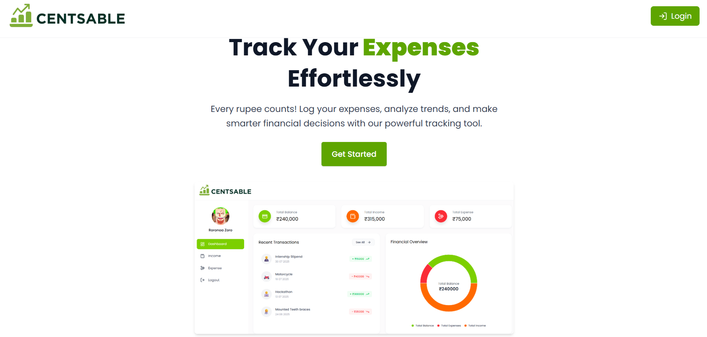
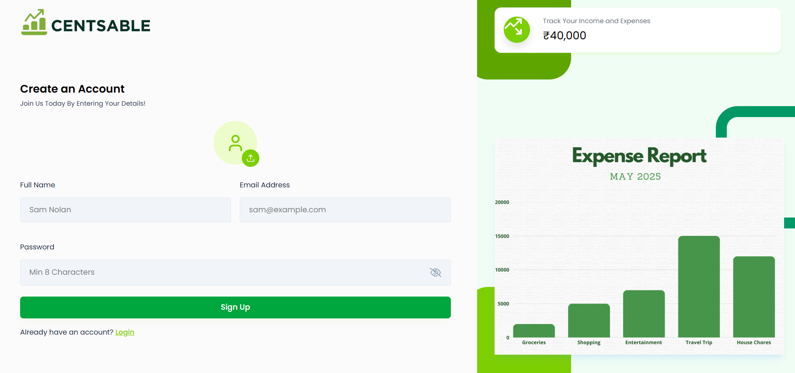
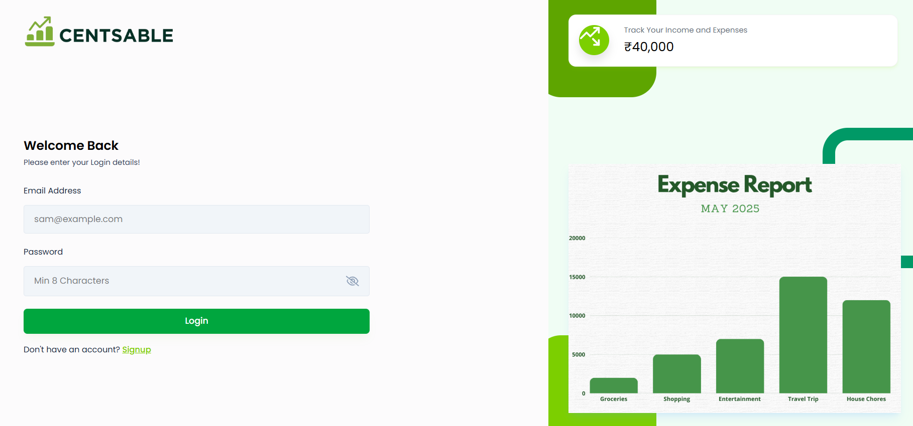
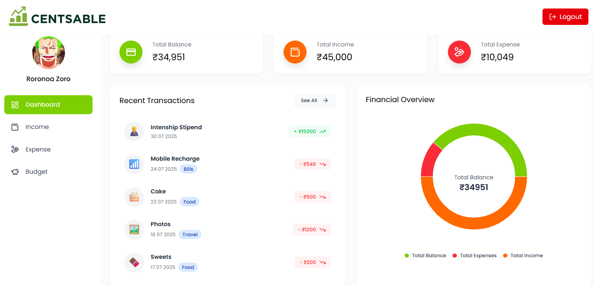
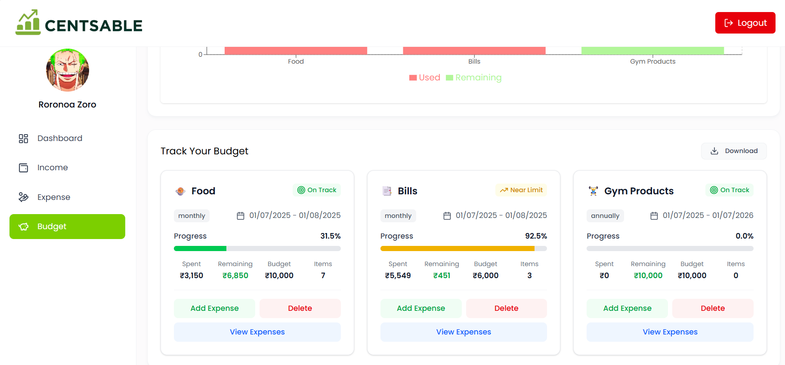
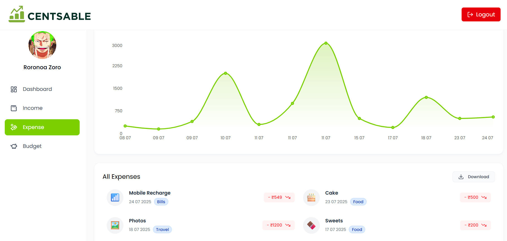

# 💰 Centsable: Smart Expense Tracking Solution

### 🌐 [🚀 Live Demo → Centsable on Render](https://centsable.onrender.com/)

---

## 🧠 Overview

**Centsable** is a modern, intelligent **expense tracking platform** built to simplify personal finance management.  
It helps users **visualize spending patterns**, **set budgets**, and **gain financial control** — all through a sleek, responsive, and data-driven interface.

Whether you're a student managing a tight budget or a professional aiming for smarter financial discipline, Centsable empowers you to **spend wisely and save smartly**.

---

## ✨ Key Features

- 🔐 **Secure Authentication** – JWT-based login & signup system  
- 📊 **Budget Management** – Set goals & track visual progress  
- 💸 **Expense Tracking** – Categorize and view spending by time & category  
- 📈 **Interactive Analytics** – Beautiful charts powered by Recharts  
- ☁️ **Cloudinary Integration** – Image uploads for receipts or categories  
- 🧮 **Real-time Budget Consumption Stats**  
- ⚙️ **Environment-based Configurations** for better scalability  
- 🧪 **Testing Ready** – Unit & integration test scaffolding included  
- 🧰 **RESTful API** with modular routes & role-based access

---

## 🛠 Tech Stack

### 🎨 Frontend
| Technology | Description |
|-------------|--------------|
|  | Component-based UI framework |
|  | Modern utility-first CSS styling |
| React Router | Client-side routing |
| Axios | API communication |
| Recharts | Data visualization & charts |

### ⚙️ Backend
| Technology | Description |
|-------------|--------------|
|  | JavaScript runtime for backend |
|  | Minimal web framework |
| MongoDB + Mongoose | NoSQL database with schema modeling |
| JWT + Bcrypt | Authentication & password security |
| Cloudinary SDK | Cloud-based image storage & optimization |

### 🔧 DevOps & Tooling
| Tool | Purpose |
|------|----------|
|  | CI/CD automation |
| ESLint + Prettier | Code linting & formatting |
| dotenv | Environment variable management |
| Render / Netlify / Vercel | Frontend deployment |
| Render / Railway / AWS EC2 | Backend deployment |

---

## 📦 Installation & Setup

### ⚙️ Prerequisites
Ensure you have the following installed:
- [Node.js](https://nodejs.org/) (v18+)
- [MongoDB](https://www.mongodb.com/) (Local or Atlas)
- [Cloudinary](https://cloudinary.com/) account
- [Git](https://git-scm.com/)

---

### 🧩 Local Setup (Without Docker)

#### 1️. Clone the repository
```bash
git clone https://github.com/your-username/centsable.git
cd centsable
```

#### 2. Configure environment variables
Create a .env file inside the backend/ directory and add:
```bash
PORT=5000
MONGO_URI=your_mongodb_uri
JWT_SECRET=your_jwt_secret
CLOUDINARY_CLOUD_NAME=your_cloud_name
CLOUDINARY_API_KEY=your_api_key
CLOUDINARY_API_SECRET=your_api_secret
```

#### 3. Install dependencies
```bash
cd backend && npm install
cd ../frontend && npm install
```

#### 4. Run the development servers
```bash
npm run dev
```

## 🖼 Screenshots

### 🔐 Landing Page


### 📝 Signup Page


### 🔐 Login Page


### 📊 Dashboard


### 💰 Budget Page


### 💸 Expenses Page


### 📈 Income Page


## 💡 Future Scope

- 🤖 AI-powered spending predictions & insights 
- 📱 Mobile App (React Native or Flutter)
- 🌍 Multi-currency & localization support 
- 🧮 Automation of Expense Tracking via messages and emails after spending using Internet Banking  


#### 👨‍💻 Author

Sameer Shaikh
