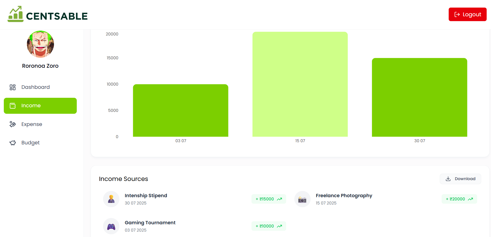

# 💰 Centsable: Smart Expense Tracking Solution


---

## 🚀 Project Overview

**Centsable** is a sleek, intelligent, and fully-featured **expense tracking system** designed to help individuals manage budgets, visualize spending patterns, and make smarter financial decisions. Whether you're a student managing a tight budget or a professional aiming for financial discipline, Centsable offers an intuitive interface, real-time insights, and powerful analytics to put you in control of your money.

Key goals of Centsable:
- Provide **visually engaging dashboards** for expenses and budgeting.
- Enable users to **track spending by category**, timeline, and source.
- Offer a clean **UX with mobile-responsive design**.
- Allow modular growth for future integrations and AI-powered insights.

---

## ✨ Features

- 🔐 **Secure Authentication** (JWT-based login system)
- 📊 **Budget Management** with visual insights
- 💸 **Expense Tracking** by category and time
- 📈 **Interactive Charts** using Recharts
- 💾 **Cloudinary Image Uploads**
- 🧮 **Real-time Budget Consumption Stats**
- 📁 **RESTful API with Role-based Access**
- ⚙️ **Environment-Based Configuration**
- 🧪 **Unit & Integration Testing Ready**

---

## 🛠 Tech Stack

**Frontend**  
   
- React.js  
- Tailwind CSS  
- React Router  
- Axios  
- Recharts

**Backend**  
   
- Node.js  
- Express.js  
- MongoDB + Mongoose  
- JWT, Bcrypt  
- Cloudinary SDK

**DevOps & Tools**  
   
- GitHub Actions  
- ESLint + Prettier  
- dotenv  
- Render / Netlify / Vercel (Frontend)  
- Render / Railway / AWS EC2 (Backend)

---

## 📦 Installation

### ⚙️ Prerequisites

- [Node.js](https://nodejs.org/) (v18+)
- [MongoDB](https://www.mongodb.com/) (local or Atlas)
- [Cloudinary](https://cloudinary.com/) account (for media upload)
- [Git](https://git-scm.com/)

### 🚀 Setup Steps

#### 🔧 Local Development (Without Docker)

1. **Clone the repository**
   ```bash
   
   git clone https://github.com/your-username/centsable.git

2. **Setup Environment Variables**
    ```bash

    PORT=5000
    MONGO_URI=your_mongodb_uri
    JWT_SECRET=your_jwt_secret
    CLOUDINARY_CLOUD_NAME=your_cloud_name
    CLOUDINARY_API_KEY=your_api_key
    CLOUDINARY_API_SECRET=your_api_secret

Create .env files in backend/ directory.

In backend/.env

3. **Install dependencies**
    ```bash 

   cd backend && npm install
   cd ../frontend && npm install


3. **Run Both Severs**
    ```bash 

   npm run dev


Centsable Live: https://centsable.onrender.com/ 


## 🖼 Screenshots

### 🔐 Landing Page


### 📝 Signup Page


### 🔐 Login Page


### 📊 Dashboard


### 💰 Budget Page


### 💸 Expenses Page


### 📈 Income Page



 
   
